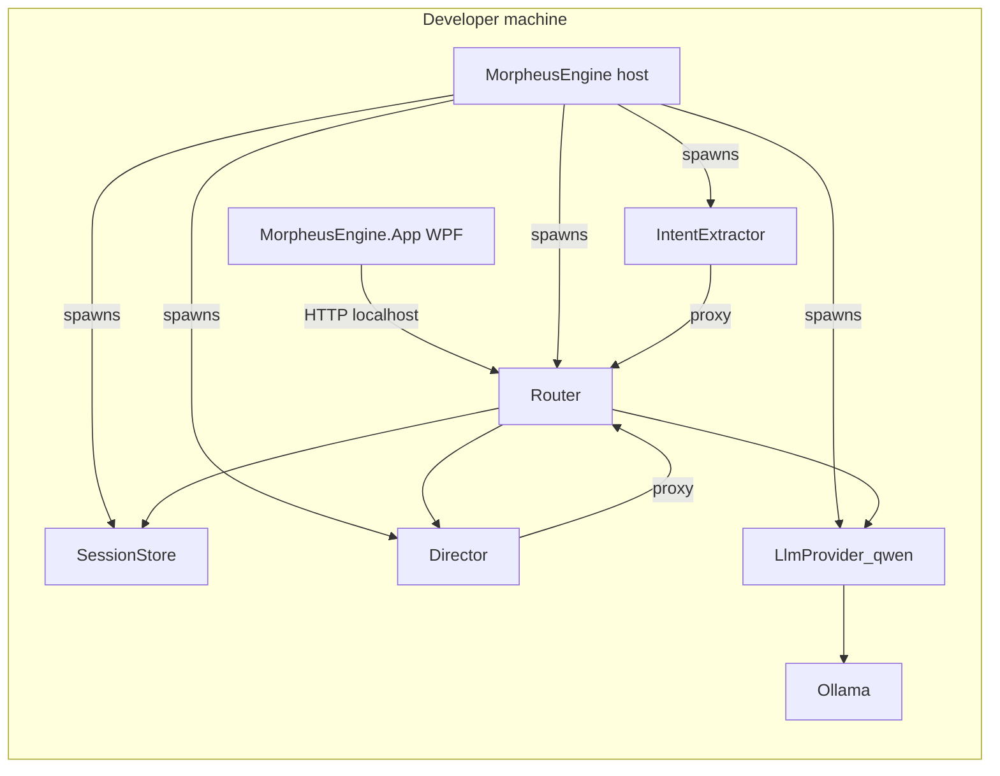

# Architecture overview

MorpheusEngine is a **local-first orchestration stack** for a text-heavy game engine: multiple **.NET console processes** communicate over **HTTP on localhost**, coordinated by a shared JSON configuration. A **WPF desktop app** is the primary operator UI; it can start the same engine process graph the headless `MorpheusEngine` class would start.

## High-level diagram



The **router** is the only module the UI is required to hit for normal play (`/initialize`, `/turn`). Internal modules may call **`router /proxy`** to reach other modules on an **allowlisted** `(target_module, path, method)` triple from `engine_config.json`.

## Repository layout (conceptual)

```
engine_config.json          # Module list, ports, endpoints, aliases
game_projects/              # Per-game data and per-run SQLite under saved/
dotnet/
  MorpheusEngine.sln
  src/
    MorpheusEngine.Core/           # Config loader, ManagedModule, HTTP contracts
    MorpheusEngine.App/            # WPF UI + engine thread host
    MorpheusEngine.RouterModule/   # HTTP API gateway
    MorpheusEngine.SessionStoreModule/
    MorpheusEngine.Director/
    MorpheusEngine.IntentExtractor/
    MorpheusEngine.LlmProvider_qwen/
```

## Engine host (`MorpheusEngine` class)

`dotnet/src/MorpheusEngine.Core/MorpheusEngineCore.cs`:

- Loads **`EngineConfiguration`** once via `EngineConfigLoader.GetConfiguration()` (finds repo root from `engine_config.json`).
- Constructs one **`ManagedModule`** per `modules[]` row.
- **`Initialize`**: starts every process, then polls **`GET /health`** on each **required** module until success or timeout.
- **`Update`**: currently a no-op sleep loop (reserved for future tick work).
- **`Shutdown`**: posts **`POST /shutdown`** to each module in **reverse** order, then waits for exit.

## WPF application

`dotnet/src/MorpheusEngine.App/`:

- Hosts **`MainWindow`**: manual HTTP client to router, raw HTTP tester tab, and a **Game** tab that sends **`TurnRequest`** to **`POST /turn`** after **`POST /initialize`** once per UI session.
- Starts **`MorpheusEngine`** on a background task when the user starts the engine so child processes keep running while the UI stays responsive.

## Design principles (engineering)

- **Fail fast**: invalid config or missing artifacts throw at startup (see `EngineConfigurationException`, `ManagedModule` artifact checks).
- **Security posture for localhost**: router **`/proxy`** refuses any path not declared on the target module in `engine_config.json` (reduces arbitrary forward risk even on loopback).
- **Shared contracts**: HTTP JSON types live in **`MorpheusEngine.Core`** so every module and the UI agree on shapes without circular project references.

## Coding standards

Workspace rule **`.cursor/rules/CodingStyle.mdc`** applies to C# changes (commenting, class layout, sealed records by default, etc.).
